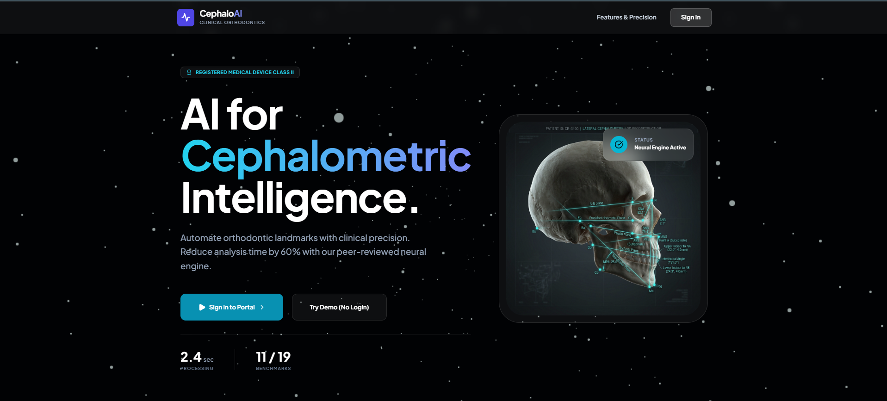
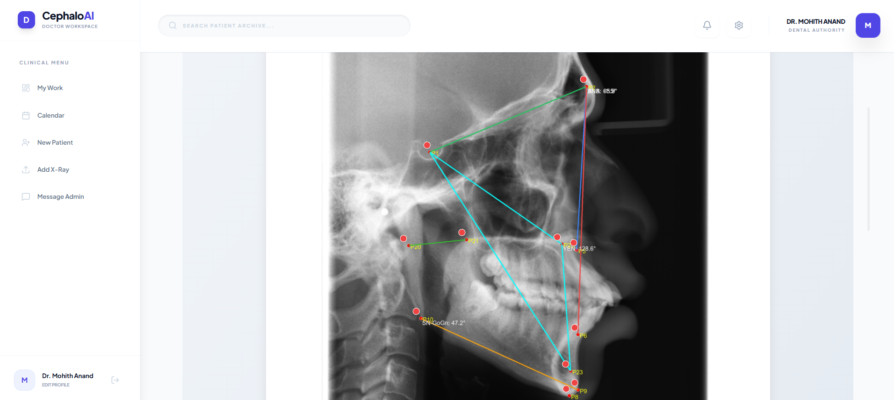

# CephAI – Intelligent Automated Cephalometric Analysis System

⚠️ **CONFIDENTIAL PROJECT – ALL RIGHTS RESERVED**

CephAI is a proprietary AI-powered system developed for automated cephalometric analysis of lateral cephalograms. It transforms imaging into actionable clinical data in seconds, ensuring sub-millimeter precision and peer-validated diagnostic accuracy.

## 🖼️ Project Preview

<p align="center">
  
</p>

<p align="center">
  
</p>

---

## 🔒 Confidentiality & Usage
This repository contains proprietary intellectual property. Unauthorized copying, distribution, modification, reverse engineering, or use of this code, models, or system design is strictly prohibited. This project is intended for academic submission, patent filing, and controlled research usage. **It is NOT open-source software.**

## 🔍 Detailed Capabilities

### 🧠 Anatomical Analysis
- **Automated Landmark Detection**: Identify 11 (Clinical) or 19 (ML Neural) anatomical benchmarks with AI precision.
- **Skeletal Classification**: Automated categorization into Class I, II, or III skeletal patterns using peer-validated models.
- **Angle Computation**: Instant calculation of critical angles including SNA, SNB, ANB, FMA, IMPA, Facial Axis, Y-Axis, and Mandibular Plane Angle.
- **Airway Analysis**: 2D pharyngeal space measurement for respiratory and surgical assessment.

### 🛠️ Clinical Workflow
- **Hybrid AI + Manual Adjustment**: Fine-tune AI-suggested landmarks with an intuitive drag-and-drop interface.
- **Dynamic Landmark Extension**: Add custom landmarks for specialized surgical or research requirements.
- **Real-Time Telemetry**: Live updating of anatomical angles as landmarks are adjusted.

### 📋 Reporting & Data Management
- **Clinical PDF Reports**: Generate professional diagnostic charts and summaries for patient documentation.
- **Master Excel Synchronization**: Real-time logging of all measurements into a centralized research database.
- **Secure Image Vault**: Encrypted storage and retrieval of patient scans and previous analyses.
- **Public Demo Mode**: One-click analysis flow with sample dataset for rapid evaluation.

---

## 🏗️ Technical Architecture

### System Components:
- **FastAPI Backend**: High-performance async pipeline for image processing and ML inference.
- **React Frontend**: Premium responsive dashboard with modern aesthetics and dark-mode support.
- **Deep Learning Layer**: TensorFlow/Keras for landmark regression; Scikit-learn for pattern classification.
- **Secure Data Management**: SQLite with SQLAlchemy ORM for lightweight and portable database operations.
- **API Documentation**: Automated Swagger/OpenAPI documentation available at `/docs`.

---

## 🚀 Getting Started

### Prerequisites
- Python 3.9+
- Node.js 16+

### 1. Backend Setup
```bash
cd backend
python -m venv venv
source venv/bin/activate  # Windows: venv\Scripts\activate
pip install -r requirements.txt
uvicorn app.main:app --reload
```

### 2. Frontend Setup
```bash
cd frontend
npm install
npm start
```

### 3. Environment Configuration
Copy the provided `.env.example` to `.env` and update the values:
```bash
cp .env.example .env
```
Key variables to configure in `backend/.env`:
```env
DATABASE_URL=sqlite:///./ceph.db
SECRET_KEY=your_secure_random_key
ALGORITHM=HS256
ACCESS_TOKEN_EXPIRE_MINUTES=60
```

---

## 🎯 Target Users
- **Orthodontists & Dentists**: For rapid clinical diagnosis and patient communication.
- **Hospitals & Clinics**: To standardize cephalometric reporting workflows.
- **Research Institutions**: For large-scale anatomical data analysis.
- **AI Researchers**: As a baseline for automated medical landmarking.

---

## 🔮 Future Enhancements
- **PINN Integration**: Physics-Informed Neural Networks for anatomical correction.
- **Multi-Model Ensemble**: Combining heatmaps and regression for 99.9% accuracy.
- **AutoCeph Module**: Comparative analysis between previous and current patient scans.
- **Cloud Analytics**: Aggregated population-level diagnostic dashboards.

---

## 👨‍💻 Project Authors
**Abhay Vijay Goudar | Gurunathagouda M Biradar | Mohith Anand | Pratham Bhat**  
*B.E. Artificial Intelligence & Machine Learning – Major Project*

---

## 📜 Intellectual Property Status
This project is intended for patent protection. Any reproduction or usage without written permission from the authors is strictly prohibited.

**License**: Proprietary License. See LICENSE file for details.